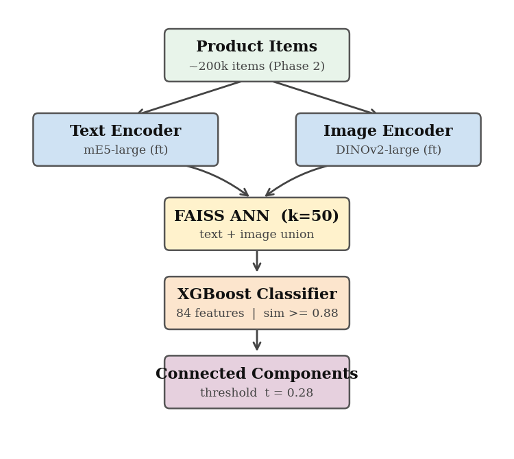
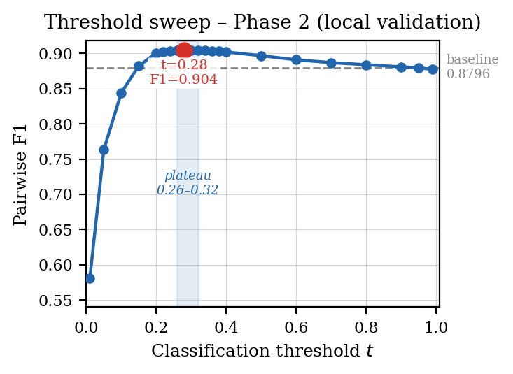

# Cross-Geo Product Matching & Grouping — GLAMI-1M

A two-stage entity-resolution system that finds duplicate fashion products across
listings from different European markets — even when titles are in different
languages, images are cropped/lit differently, and prices are in different
currencies. Built for the **NI-ADM 2026** data-mining competition (FIT CTU Prague)
on the [GLAMI-1M](https://arxiv.org/abs/2211.14451) dataset (~1.3M items, 217k
distinct product labels), original spec in [`competition.adoc`](competition.adoc).

## Task

Glami listings for the same product diverge across markets in every available
signal at once — title, description, price, image crop/lighting, and category
metadata — so no single field is a reliable match key. The competition splits
this into two differently-shaped problems:

| Phase | Given | Task | Metric | This system |
|---|---|---|---|---|
| **1** | 15,000 predefined groups of 5 items (`items_phase_1.csv`) | Binary per group: does it contain **at least one** duplicate pair (`z_g`)? | Group-level F1 | **0.993** |
| **2** | ~200k unlabeled items (`items_phase_2.csv`) | Partition *all* items into disjoint product groups, ≤100 items/group, hard clustering | Pairwise F1 — precision/recall over every same-group item pair vs. ground truth | **0.9025** (cosine-similarity baseline: 0.8796) |

Phase 1 is closed-world duplicate detection (does *this* small group contain a
match); Phase 2 is open-world clustering (partition ~200k items with no prior
grouping at all) — the harder problem, and the one the final leaderboard is
sorted by. The pipeline below is built for Phase 2; Phase 1 is solved as a
by-product by scoring all `C(5,2)=10` pairs per group and thresholding.

## The core idea

Retrieve-then-rerank pipelines (FAISS + classifier) are standard for entity
matching, but there's a subtle failure mode: if the reranker is trained on the
*full* distribution of pairs (similarity 0 → 1), it learns that
"high similarity → same product" almost perfectly — because in the full training
distribution, that correlation is very strong. At inference time it only ever
sees FAISS candidates, which are *already* high-similarity by construction. The
model ends up assigning ≈1.0 to nearly every candidate, and the whole graph
collapses into one giant cluster (F1 < 0.10).

**Fix:** retrain the classifier on exactly the similarity region the candidate
set actually occupies (cosine sim ≥ 0.88), where both true matches and
hard negatives (same brand/department/price, different product) are
plentiful. This single change is worth **+9 F1 points** in the ablation — the
entire contribution of the system is this distribution-matching step, not the
features or the encoder architecture.

## Pipeline



1. **Contrastive encoder fine-tuning (ANCE).** Two separate towers —
   `intfloat/multilingual-e5-large` (text) and `facebook/dinov2-large`
   (image) — are fine-tuned with InfoNCE, first with in-batch random
   negatives, then with FAISS-mined hard negatives inserted into the
   denominator each epoch. This produces language-agnostic embeddings so a
   Czech and a Romanian listing of the same shoe land close together.
2. **Candidate retrieval.** Top-50 text neighbours + top-50 image neighbours
   per item (FAISS IVF, inner product), unioned. Combined similarity
   `s = 0.5·s_text + 0.5·s_img`; candidates below `s = 0.88` are dropped.
   Using both modalities matters: cross-geo pairs with unrelated-looking
   titles are still catchable via image similarity.
3. **Distribution-matched pair classifier.** An 84-feature XGBoost model
   (text/image cosine + L2 distances, PCA'd embedding differences, price
   ratio, exact-match indicators for department/colour/brand) trained
   *only* on pairs in the `s ≥ 0.88` region. Val AUC 0.9990, Val F1 0.9884.
4. **Clustering.** Threshold pair scores at `t = 0.28`, build a sparse graph,
   take connected components as product groups. Components over the
   100-item submission cap are split via MST weight cut.



## What didn't work (and why)

- **Anchor bridging** via known training-set labels — two distinct products
  can both resemble the same anchor (e.g. two different red dresses), so
  bridging introduces false links. F1 dropped to 0.887.
- **A dedicated medium-similarity model** (0.70–0.88 range) to recover
  cross-geo matches — trained on ~25% positive rate but the true inference
  rate in that band is ~0.1%, a 250× mismatch that caused catastrophic
  over-merging (F1 0.27).
- **Metadata-based rule promotion** — brand/department/colour IDs are near-zero
  for most items in this dataset, so almost nothing qualified.

These are documented in [`report.tex`](report/report.tex) §4/§5 as a concrete
illustration of why matching the *inference-time* distribution beats
adding more features or more rules.

## Report

[`report.tex`](report/report.tex) is the 4-page scientific paper required by the
assignment: Introduction, Related Work, Methodology, Baselines, Experiments,
Results, Conclusion. It positions the distribution-matching fix against
Tóth et al.'s industry-scale Zalando cross-geo matching system (the assigned
SOTA reference) — that paper doesn't train its reranker on the same
similarity region its retrieval stage produces, which is exactly the failure
mode (F1 < 0.10) this project's ablation isolates and fixes.

## Repository structure

```
adm-matching/
├── README.md
├── competition.adoc        # original competition/task specification
├── categorical_mappings.json
├── scripts/                # all pipeline code (run from repo root, e.g. `python scripts/mapping_script.py`)
└── report/                 # report.tex, report.pdf, and its figures
```

| File (in `scripts/`) | Purpose |
|---|---|
| `mapping_script.py` | Builds `categorical_mappings.json` (department/colour/brand IDs → contiguous ints) |
| `finetune_contrastive.py` | First-generation contrastive fine-tuning (XLM-R + ConvNeXt-Tiny) |
| `finetune_contrastive_v2.py` | ANCE fine-tuning of mE5-large + DINOv2-large: warm-up + hard-negative refinement |
| `finetune_hard_negatives.py` | Second-pass text encoder adaptation on FAISS-mined hard negatives |
| `train_cross_encoder.py` | Alternative reranker: cross-encoder over `[title_A desc_A ; title_B desc_B]` |
| `extract_embeddings_v2.py` / `extract_embeddings_e5dino.py` | Dump backbone embeddings to HDF5 for downstream stages |
| `features.py` | Shared feature library — pair features (20/84-dim), group aggregate features |
| `pipeline_ft_v2.py` / `pipeline_ft_v5.py` | Train the pair + group XGBoost models (v5 adds 64 PCA-difference features) |
| `retrain_pair_hardneg.py` / `retrain_pair_medmatch.py` / `retrain_pair_faiss.py` | Recalibrate the pair classifier on different similarity regions (the distribution-matching experiments) |
| `ensemble_v2_v5.py` | Blend v2/v5 pair model scores |
| `phase2_pipeline.py` | End-to-end inference: retrieval → scoring → clustering → submission CSV. Supports weighted/AND/XGBoost scoring modes, dept filtering, threshold sweeps |
| `diagnose_recall.py` | Diagnostic: FAISS recall, candidate survival rate, positive rate per similarity bin |
| `generate_figures.py` | Renders `report/fig_pipeline.png` / `report/fig_sweep.png` |

| File (in `report/`) | Purpose |
|---|---|
| `report.tex` / `report.pdf` | Full scientific report (methodology, baselines, ablation, error analysis) |
| `fig_pipeline.{pdf,png}` / `fig_sweep.{pdf,png}` | Figures generated by `scripts/generate_figures.py` |

Model checkpoints (`finetuned_text_model*/`, `finetuned_image_model/`,
`finetuned_crossencoder/`), extracted embeddings (`*.h5`), FAISS/feature
caches (`cache_*.npz`), competition data (`data/`), and generated
`submissions/` are excluded from version control (see `.gitignore`) — they're
large, regenerable, and specific to a local machine, so they're kept flat at
the repo root rather than sorted into folders.

## Stack

PyTorch · Hugging Face Transformers (`multilingual-e5-large`, `dinov2-large`,
XLM-RoBERTa) · FAISS · XGBoost · scikit-learn (PCA)

## Reproducing

Run from the repo root (assumes `data/items_train.csv`, `data/items_phase_1.csv`,
`data/items_phase_2.csv` present locally — not included in this repo):

```
python scripts/mapping_script.py                    # categorical_mappings.json
python scripts/finetune_contrastive_v2.py            # fine-tune text + image towers
python scripts/extract_embeddings_e5dino.py          # embeddings -> HDF5
python scripts/pipeline_ft_v2.py                     # baseline pair/group XGBoost
python scripts/retrain_pair_hardneg.py               # distribution-matched pair classifier
python scripts/phase2_pipeline.py --use_model ... --threshold 0.28   # produce submission
python scripts/generate_figures.py                   # figures for report/report.tex
```
